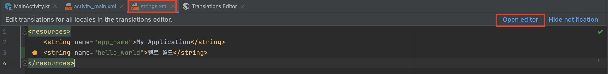
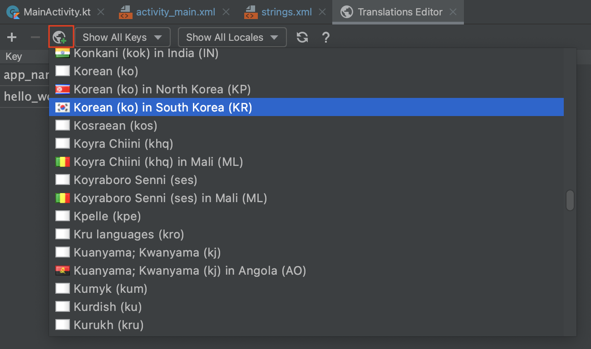
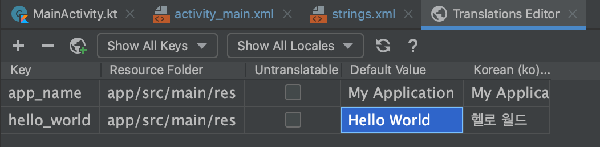

## 3장

### 🖥 기본 화면 구성 

* __Android__ : 안드로이드용으로 최적화된 모드. 주로 이 모드로 작업.
* __Project__ : 실제 폴더 구조대로 보는 모드. Android 모드일 때는 보이지 않는 파일을 찾을 때 사용.

---

### 📁 프로젝트 구조

* __manifests/AndroidManifest.xml__ : 앱 구성을 기술한 파일. 주로 매니페스트라고 언급하면 이 파일을 가르키는 것. 보통은 자동으로 작성되는데, 특정 작업을 하기 위해 앱에 권한을 추가할 때는 직접 편집함. 예를 들어 액티비티가 몇 개인지 어느 액티비티가 시작 부분인지와 같은 정보가 들어 있음.
* __java/{package name}/MainActivity.kt, res/layout/activity_main.xml__ : MainActivity.kt 파일에는 코드를 작성하고,  activity_main.xml 파일에는 화면 레이아웃을 작성. 이 둘이 한 세트라고 생각!
* __Gradle Scripts/build.gradle__ : 프로젝트 수준과 모듈 수준의 build.gradle 파일은 안드로이드 빌드 구성 파일
  * 빌드 - 프로그램을 실행 가능한 상태로 만드는 과정

---

### ✔️ 문자열을 리소스로 만들기

위의 fix를 누르면 다음과 같은 창이 뜸.

[Resource name]에 [hello_world]라고 입력하고 [OK]를 클릭

이는 "헬로 월드" 문자열이 hello_world라는 이름의 문자열 리소스로 변경이 된 것.

문자열 리소스는 res/values/strings.xml 파일에 정의되어 있음.

---

### 🌎 다국어 추가하기

1. Add Locale 아이콘 클릭
2. 한국어를 추가하려면 [Korea (ko) in South Korea] 선택
3. Default Value는 번역하지 않은 값으로, 주로 영어를 작성. 

4. Activity_main.xml에서 기기의 언어 설정을 한국어와 다른 언어로 변환해가며 확인

---

### 🖥 액티비티

* 안드로이드에서는 화면을 액티비티라고 함
* 프로젝트를 생성 시, MainActivity.kt 파일이 곧 액티비티 파일
* AppCompatActivity 클래스는 구 버전 안드로이드 기기에서도 최신 기능을 쓸 수 있게 해주는 기능을 제공 → 하위호환이 되는 앱을 만들려면 반드시 AppCompatActivity 클래스를 상속받아야 함
* onCreate() 메서드는 액티비티가 시작되면 최초로 호출되는 메서드로 반드시 부모클래스의 생성자를 호출해야 함
* setContentView() 메서드는 액티비티가 표시할 레이아웃 파일을 지정하며, R.layout.activity_main은 res/layout/activity_main.xml 파일을 가르킴
* R이란 안드로이드 스튜디오에서 자동으로 생성되는 리소스 정보를 가지는 클래스
* 의미가 있는 ID를 주는 것이 코드 작성 시 도움이 됨
