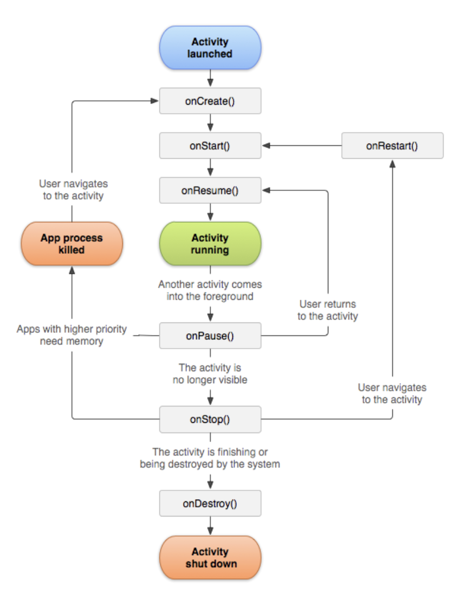

1. 뷰바인징 - xml 레이아웃의 id를 쉽게 접근하기 위해 사용하는 기능

2. **액티비티의 생명주기**

   1. onCreate() - 생성 시점에 호출됨. 콜백 메서드(특정한 타이밍에 호출되는 메서드). onCreate() 메서드를 오버라이드 하여 프로그램을 작성하면 액티비티가 시작되면서 작성한 프로그램이 자동으로 시작
   2. 1번 이후 onStart() 메서드와 onResume() 메서드 순으로 호출됨
   3. onPause() - 액티비티 종료 시 화면에서 보이지 않게 되는 순간 호출됨
   4. onStop() - 액티비티가 완전히 보이지 않게 될 때 호출됨
   5. onDestroy() - 마지막으로 호출됨. 메모리에서 해체하는 객체가 있는 경우.
   6. onRestart(), onStart(), onResume() - 액티비티 재개

   

3. 센서 사용 준비

   1. SensorManager 인스턴스 얻기
      1. SENSOR_DELAY_FASTEST : 가능한 가장 자주 센서값을 얻음
      2. SENSOR_DELAY_GAME : 게임에 적합한 정도로 센서값 얻음
      3. SENSOR_DELAY_NORMAL : 화면 방향이 전환될 때 적합한 정도로 센서값 얻기
      4. SENSOR_DELAY_UI : 사용자 인터페이스를 표시하기에 적합한 정도로 센서값 얻음

   ```kotlin
   class MainActivity : AppCompatActivity(), SensorEventListener {
   
       private val sensorManager by lazy {
           getSystemService(Context.SENSOR_SERVICE) as SensorManager
       }
       
       override fun onCreate(savedInstanceState: Bundle?) {
           super.onCreate(savedInstanceState)
           setContentView(R.layout.activity_main)
       }
   }
   ```

   

   2. 위 표에 있는 센서 중 하나인 getDefaultSensor() 메서드에 지정하여 Sensor 객체 얻기
      1. SensorEvent.values[0] : x축 값
      2. SensorEvent.values[1] : y축 값
      3. SensorEvent.values[2] : z축 값

   3. onResume() 메서드에서 registerListener() 메서드로 센서의 감지 등록

   4. onPause() 메서드에서 unregisterListener() 메서드로 센서의 감지 해제

   5. Log.d() -  로그 표시
      1. 태그 - 로그캣에는 많은 내용이 표시되므로, 필터링 시 사용
      2. 메시지 - 출력할 메시지 작성

   ```kotlin
   // 디버그용 로그를 표시 시 사용
   Log.d([태그], [메시지])
   
   // Log.e() - 에러 표시 시 사용
   // Log.w() - 경고 표시 시 사용
   // Log.i() - 정보성 로그 표시 시 사용
   // Log.v() - 모든 로그 표시 시 사용
   ```